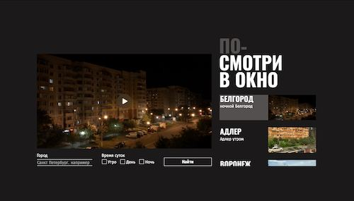

# Это учебный проект для Яндекс Практикум

Вторая проектная работа по направлению Фулл-стак разработчик на платформе Яндекс Практикум. Pixel-perfect верстка по макету из фигмы с акцентом на элементах формы.

Ссылка для автотестов:
https://github.com/konopat/posmotri_v_okno.git
